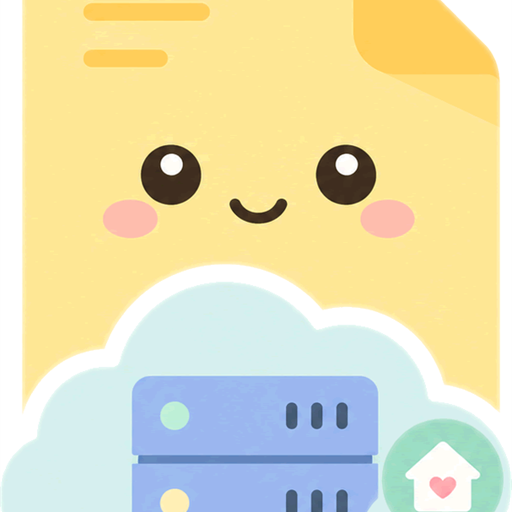

<div align="center">
  

# Keeparr

### Self-hosted notes with a Google Keep-style feel

[](https://github.com/paolostivanin/Keeparr/actions/workflows/ci.yml)
[](LICENSE)

</div>

Keeparr is a self-hosted notes app built for quick capture: text notes, checklists, images, drawings, links, attachments, labels, colors and reminders. It has a web app (installable as a PWA), a Node/SQLite server, an MCP server for agents, and a native Android client.

> **Origin.** Keeparr is a modified derivative of [Kept](https://github.com/ericerkz/kept) by ericerkz.
> Original project license: GNU Affero General Public License v3.0-only.
> This version contains substantial modifications and additional copyrightable work by Paolo Stivanin and other contributors.
> Unless otherwise stated, the combined work is distributed under the GNU Affero General Public License v3.0-only.
> See [`NOTICE`](NOTICE) and [`LICENSE`](LICENSE).

## Features

- Text notes, checklists, image notes, drawings, links with previews, and file attachments.
- Drag-and-drop ordering of notes and checklist items.
- Labels, binders, colors, background images, pins, archive and trash.
- Search and filters by note type, label and date-style queries.
- Time reminders with recurrence and browser push notifications.
- Real-time collaborative sharing of notes between users on the same instance.
- Offline viewing and editing on web and Android, with automatic sync when the client reconnects.
- Google Keep Takeout import.
- Built-in SQLite backups and restore.
- Local accounts with optional 2FA and user management; optional OpenID Connect single sign-on.
- Local and remote MCP server for authenticated agent access, and OAuth 2.1 for scoped third-party integrations.

## Clients

**Web / PWA.** Open your server in a browser. Install it as a PWA from a secure `https://` URL for reliable mobile installs and push notifications.

**Android.** The native client in [`android-native/`](android-native) is written in Kotlin with Jetpack Compose (Android 14+, minSdk 34). It syncs through the incremental mutation protocol, works offline with an outbox, has time reminders, share-sheet capture, home screen widgets (notes list and quick create), and supports client certificates for mutual TLS. An APK is attached to each [GitHub release](https://github.com/paolostivanin/Keeparr/releases) with a SHA-256 checksum, a GPG signature and the signing-certificate fingerprint, or you can build it from source (see [Development](#development)). On-device acceptance testing is still in progress, see [`PLAN.md`](PLAN.md).

## Quick start (Docker)

Requirements: Docker with Compose, and Git.

```bash
git clone https://github.com/paolostivanin/Keeparr.git
cd Keeparr
docker compose up -d
```

Open `http://localhost:6767` and create the first admin account.

Keeparr stores its database, uploads, attachments and generated server data in `./data`. Back that folder up, or use the built-in backup tools.

The compose file pulls the multi-arch (amd64, arm64) image `ghcr.io/paolostivanin/keeparr:latest`. Release tags are also published as `2.1.0`, `2.1` and `2`; pin one of those in `docker-compose.yml` if you do not want to follow `latest`. To build from the local source instead, add the dev override: `docker compose -f docker-compose.yml -f docker-compose.dev.yml up -d --build`.

### Updating

```bash
docker compose pull
docker compose up -d
```

If you build from source: `git pull`, then rerun the build command above.

Your `./data` folder is not replaced by updates.

## Configuration

Set environment variables in `docker-compose.yml` (commented examples are included).

| Variable | Purpose |
|---|---|
| `PORT` | Listen port. Defaults to 3000 outside Docker; the image sets 6767. |
| `BASE_URL` | Public origin used for OAuth/OIDC callbacks. Required for remote MCP, OAuth and OIDC. |
| `DATA_DIR`, `SQLITE_PATH` | Data directory (default `./data`) and database file (default `<data>/keeparr.sqlite`). |
| `UPLOAD_DIR`, `ATTACHMENT_DIR`, `TAKEOUT_TMP_DIR` | Override where uploads, attachments and Takeout temp files are stored. |
| `PUID` / `PGID` | Run the container as a specific Linux user/group. `KEEPARR_SKIP_CHOWN=1` skips the ownership fix at start. |
| `KEEPARR_SESSION_TTL_DAYS` | Login session lifetime. Defaults to 30. |
| `KEEPARR_TRUST_PROXY` | Reverse proxies in front of Keeparr: a hop count (default 1), or a list of proxy addresses/subnets. Use 0 when the port is reachable directly, so clients cannot spoof their address and bypass the login rate limit. |
| `KEEPARR_CORS_ALLOW_ALL` / `KEEPARR_CORS_ORIGINS` | CORS for remote clients. See [deployment](docs/deployment.md#vpn-tailscale-wireguard-and-multiple-domains). |
| `KEEPARR_OIDC_ISSUER`, `_CLIENT_ID`, `_CLIENT_SECRET`, `_NAME`, `_SCOPES` | Optional OIDC single sign-on. See [oidc.md](docs/oidc.md). |
| `KEEPARR_ALLOW_RESTORE` | Temporarily enables restore from backup during setup. |
| `KEEPARR_TAKEOUT_UPLOAD_MAX` / `KEEPARR_TAKEOUT_UPLOAD_MAX_BYTES` | Google Takeout ZIP upload cap. Defaults to `5GB`. |
| `KEEPARR_LINK_PREVIEW_SCREENSHOTS` | Set to `0` to stop using a third-party screenshot service for link previews. |
| `VAPID_PUBLIC_KEY`, `VAPID_PRIVATE_KEY`, `VAPID_SUBJECT` | Web push identity. Keys are generated into `data/vapid.json` if unset. |

## Deployment

Reverse proxy examples (Apache, Nginx), VPN and CORS notes, custom headers for the Android app, and backup/restore steps are in [`docs/deployment.md`](docs/deployment.md). Integrations:

- [OIDC single sign-on](docs/oidc.md)
- [OAuth 2.1 apps](docs/oauth.md)
- [MCP (local stdio and remote `/mcp`)](docs/mcp.md)

## Development

Requirements: Node 24 (`.nvmrc`), npm 10+, and JDK 17 plus the Android SDK for the Android client.

```bash
npm install
npm start        # API on :3000 and the web UI on :6767, which proxies /api and /uploads
```

| Command | What it does |
|---|---|
| `npm run api` / `npm run client` | Run the server or the Angular dev server alone. |
| `npm run build` | Production web build into `dist/`. |
| `npm test -- --watch=false --browsers=ChromeHeadless` | Web unit tests (Karma). |
| `npm run test:native`, `test:sync`, `test:reminders`, `test:utils`, `test:server`, `test:scale`, `test:mcp` | Server, protocol, web-utility and MCP tests. |
| `npm run benchmark:web`, `benchmark:server` | Performance harness, see [`docs/performance.md`](docs/performance.md). |
| `npm run mcp` | Run the local stdio MCP server. |

### Android

```bash
cd android-native
./gradlew testDebugUnitTest assembleDebug lintDebug    # what CI runs
./gradlew assembleRelease
adb install -r app/build/outputs/apk/release/app-release.apk
```

Without signing configuration the release build is signed with the debug key and must not be distributed. For a real release provide a keystore through `KEEPARR_RELEASE_KEYSTORE`, `KEEPARR_RELEASE_STORE_PASSWORD`, `KEEPARR_RELEASE_KEY_ALIAS`, `KEEPARR_RELEASE_KEY_PASSWORD` (or the matching `-Pkeeparr.release.*` properties). Shrinking is opt-in with `-Pkeeparr.minify=true`.

### Documentation

- [`docs/architecture.md`](docs/architecture.md): ownership map and durable-write invariants.
- [`docs/sync-protocol.md`](docs/sync-protocol.md): the mutation/changes sync contract.
- [`docs/native-android-plan.md`](docs/native-android-plan.md): Android client plan and status.
- [`PLAN.md`](PLAN.md): maintainability milestones and execution log.

### Icons

The icon sources and regeneration script are in [`branding/`](branding).

## Contributing

See [`CONTRIBUTING.md`](CONTRIBUTING.md). Contributions are licensed under AGPL-3.0-only.

## License and credits

Keeparr is licensed under the [GNU Affero General Public License v3.0 only](LICENSE). If you modify Keeparr and let users interact with it over a network, section 13 of the AGPL requires you to offer them the Corresponding Source.

- Keeparr is a modified derivative of [Kept](https://github.com/ericerkz/kept) by ericerkz (Copyright (c) 2026 ericerkz, AGPL-3.0-only).
- Kept's initial UI scaffolding was forked from [aBrihoum/google-keep-clone](https://github.com/aBrihoum/google-keep-clone) (MIT).

Full attribution is in [`NOTICE`](NOTICE).
