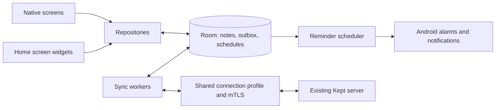

# Native Android client plan

Status: implementation in progress, based on repository revision `f97698d` and the Android investigation on 2026-10-03. The server protocol extensions, native project foundation, and first app flows are present; device acceptance and the complete release scope are still outstanding. The plan below remains the product and validation target.

Implementation review found correctness defects and unfinished flows. Feature presence in the checkpoint below does not mean acceptance is complete. Follow [the remediation and completion handoff](native-android-remediation-plan.md) for prioritized fixes, regression tests, and release gates.

## Implementation checkpoint

- WP0–WP10 code work is implemented with server/client migration and behavioral coverage: revocation, crash-atomic mutation receipts, schedule-definition versions, durable upload replay, Room outbox migrations, editor/conflict lifecycle, rich-content preservation, offline occurrences, profile/mTLS recovery, and typed conflict/personal-state handling. Protocol v3 and shared timezone/content fixtures are in place. WP11 UI/widget/accessibility implementation is in progress; WP12 remains the final integration and release gate.
- The Android project now includes offline notes, editing/organization, collaboration/conflict recovery, reminder scheduling and management, mTLS connection setup, ordered collection/single-note/quick-create widgets, and redacted diagnostics.
- Automated checks pass as of 2026-10-05: `npm run test:native`, `npm run test:sync`, `npm run test:reminders`, `npm run build`, `./gradlew testDebugUnitTest assembleDebug lintDebug`, and `git diff --check`.
- Still to capture on the target setup: installed Keep/Kept APK references and UI captures. Still to verify on devices: certificate and widget flows through the real Cloudflare policy, notification delivery through process death/reboot/permission changes, two-user web/native collaboration and revocation, accessibility, and release performance across the specified Android versions and launchers.

## Product direction

Build a Kotlin Android client for the existing Kept server. Preserve the familiar Kept/Google Keep experience: quick capture, colorful cards, checklists, manual ordering, pinned notes, labels, and uncomplicated editing. Use the installed apps as references for visual behavior and interaction; implement the native client with its own code and appropriate assets.

The first complete release includes time reminders, collaboration with users on the same server, native UI, installed-client-certificate mTLS, and compact widgets that follow the app's ordering. Offline editing is part of the foundation. Location reminders, AI capture, and a drawing editor come later.

Build initially in an independent Gradle project under `android-native/`, with a distinct application ID so it can coexist with the current Kept app. Keep the existing server, accounts, and web client usable during development. Ship backward-compatible server extensions as focused changes.

## What the server already provides

| Area | Existing implementation | Native-client implication |
| --- | --- | --- |
| Login | `POST /api/auth/login`, bearer sessions, TOTP and backup-code support | Reuse Kept accounts. Store credentials once for all app entry points. |
| Notes | Note CRUD, checklists, labels, binders, colors, images, attachments, archive/trash | Most product behavior already has a server model. |
| Ordering | Per-user pinning and positions; bootstrap sorts by pin, effective order, then ID descending | The app and widgets can share the same ordered local query. |
| Sharing | User discovery and note collaborator endpoints; server checks owner/editor access | Reuse the current owner/collaborator model. |
| Realtime | `/api/realtime`, note-change events and active-editor presence | Refresh through incremental sync while the app is active. |
| Offline sync | `/api/sync/bootstrap`, `/api/sync/changes`, `/api/sync/mutations`; stable sync IDs and timestamp-based conflict stamps | Reuse protocol concepts and IDs, with a durable native outbox. |
| Reminders | Reminder CRUD/sync, UTC due time, timezone, repeat rules, server scheduler, browser push | Keep schedules on the server and schedule Android delivery locally. |

Source locations: [server](../server/server.js), [note model](../src/app/interfaces/notes.ts), [reminder model](../src/app/interfaces/reminder.ts), [web sync client](../src/app/services/offline-sync.service.ts), [web note client](../src/app/services/notes.service.ts).

## Server gaps to resolve

The following two server fixes are agreed scope for this project and must be implemented in stage 1 before the native reminder and collaboration features depend on them.

1. **Concurrent edits:** note sync currently chooses a winner for the whole note using a last-write-wins stamp. WebSockets announce changes and presence; they do not merge simultaneous edits. Add an opt-in protocol with a base revision and atomic conflict rejection, returning the latest note on conflict. Preserve the losing draft locally and offer comparison/recovery. Apply revision tracking to every write path, including existing web edits. Retain existing endpoints for old clients and describe their overwrite behavior accurately. Character-by-character shared editing is a later project.
   **Acceptance:** two users save edits from the same base revision; one guarded save succeeds and the other receives a conflict with the latest content. The rejected draft remains recoverable. A web edit also changes the revision, so a stale native save is rejected. Retrying an accepted operation does not apply it twice.
2. **Personal reminders on shared notes:** the current schema has `noteId UNIQUE`, and reminder creation uses `ON CONFLICT(noteId)`. A second user can replace the first user's reminder. Migrate to a reminder per `(userId, noteId)` for note-linked reminders. Update CRUD, sync, imports, calendar integration, and note-reminder enrichment consistently. Check reminder ownership before applying sync mutations. Define standalone reminders separately.
   **Acceptance:** two collaborators create different reminders on the same note, and both survive independently. Editing, snoozing, dismissing, or deleting one user's reminder leaves the other's unchanged. Cross-user mutation attempts are rejected, and migration preserves existing reminders and their sync identities. Existing web reminder flows remain functional.

Additional protocol work needed for the native client:

3. **Reminder occurrences:** the server advances repeating reminders and marks one-shot reminders fired. Native delivery must survive these transitions without skipping a notification or advancing a repeat twice. Add a stable occurrence identity, original due time, schedule version, and idempotent snooze/dismiss actions to the native protocol. Retain a bounded occurrence history in sync so an offline phone can reconcile missed occurrences. A server `fired` state alone must not mean that this phone displayed the notification.
4. **Retry semantics:** verify existing mutation replay behavior, then make new operations idempotent by persistent operation ID. Define rejected/conflicting mutation responses and access-revocation behavior. Retain local edits until the server explicitly accepts them or the user resolves them.
5. **Capabilities:** add a small authenticated client-capabilities endpoint advertising protocol versions, revision checks, and occurrence support. Give older servers a clear compatibility result rather than silently using unsupported behavior.

Use two test users and the existing web app to verify every extension. Do not assume that collaborator permissions, locked notes, or attachments behave like owner-created plain text notes.

## Native architecture

| Component | Proposed choice | Responsibility |
| --- | --- | --- |
| Language/UI | Kotlin, Jetpack Compose, Material 3 | Native screens, note cards, editing, dialogs, accessibility |
| Local data | Room, coroutines and Flow | Notes, ordering, reminders, outbox, conflicts and sync cursors |
| Networking | OkHttp and Kotlin serialization | REST, authenticated media, WebSockets and mTLS |
| Background work | WorkManager | Outbox retry, opportunistic refresh, media transfers |
| Time reminders | AlarmManager, receivers and Android notifications | Delivery from persisted local schedules |
| Widgets | RemoteViews collection widgets | Compact scrollable notes and checklist actions |
| Connection settings | DataStore plus Android Keystore-backed credential storage | Server URL, certificate alias, header settings and session |

Use one connection-profile provider for the app, widget workers, media loader, and WebSocket. Partition data and job identities by profile and user, even if the first UI supports only one active account. Do not maintain a separate widget login token.

Persist a local edit and its outbox operation together before updating the UI. Reads come from Room. Use cursor changes for synchronization; WebSocket events trigger pulls, and reconnect always catches up from the durable cursor. Background refresh uses scheduled work rather than a permanent socket/service. This follows Android's [offline-first data-layer guidance](https://developer.android.com/topic/architecture/data-layer/offline-first).

Start with Android 8/API 26 as the proposed minimum. Pin stable tooling and dependency versions at implementation time and test current Android releases, particularly the user's Android 16 OnePlus device.

## 1. Time reminders

The app saves a reminder locally, schedules its Android alarm immediately, and queues server synchronization. Scheduling an already-synced reminder does not depend on having a connection when it becomes due.

- Offer date/time selection, today/tomorrow presets, daily/weekly/monthly/custom-day repeats, and a reminders view.
- Notifications open the note and offer snooze and dismiss. Actions persist locally and synchronize later.
- Use a one-shot alarm for each occurrence and compute the next occurrence with timezone-aware recurrence rules compatible with the server. Specify daylight-saving and month-end behavior in fixtures.
- Keep a delivery ledger keyed by profile, reminder sync ID, schedule version, and occurrence. Deduplicate local alarms and server events on this device. Before posting, verify that the alarm still matches the locally stored schedule.
- Reconcile on startup, sync, reboot after unlock, app update, clock/timezone changes, and alarm-permission changes. Cancel alarms when reminders are deleted, notes become inactive/inaccessible, or the account logs out.
- Default to one notification per occurrence per device. Snooze/dismiss state synchronizes; a second device that is offline cannot immediately know about an action elsewhere.
- Provide a test-notification action and a reminder status screen showing notification access, precise-alarm access, and the next scheduled reminder. Explain permission problems when they affect a reminder the user is creating.

For precise reminders, request `SCHEDULE_EXACT_ALARM` where required and check access before scheduling; otherwise use an inexact fallback and state that delivery may be delayed. [Android alarm documentation](https://developer.android.com/develop/background-work/services/alarms) describes these permissions and delivery modes. Notifications need their own permission and enabled channel.

Delivery guarantees cover schedules present on the device. Reminders created elsewhere require a successful sync before local delivery is possible. Android force-stop prevents normal delivery until the app is reopened; [Android 15's stopped-state behavior](https://developer.android.com/about/versions/15/behavior-changes-all) cancels pending intents. Ordinary process death or swiping the app away must pass the delivery tests.

**Acceptance:** a locally created or synced reminder fires while the app process is gone and the device is offline; snooze works offline; reboot reconstructs schedules; repeating reminders do not double-advance when the server also fires; edits/deletes cancel stale alarms.

## 2. Same-server collaboration

- Add/remove collaborators through Kept's existing user selector and owner-only sharing endpoints. Show who owns a note and who can edit it.
- Allow collaborators to edit the fields the server permits. Keep user-specific pins and manual ordering separate from shared content.
- Display current editors while connected. Apply incoming updates without replacing an unsaved draft or jumping the cursor.
- Base-revision checks prevent the native client from silently overwriting newer content. Save conflicting local drafts and allow explicit comparison, replacement, or saving a copy. Checklist-item merges can follow once stable identities and protocol semantics are defined.
- Sharing changes require a connection initially; ordinary edits can queue offline. When access is revoked and observed, remove cached shared content and media, cancel its alarms, and refresh widgets. Preserve pending edits in a recovery flow without sending them to an inaccessible note.
- Sharing a note does not automatically share personal reminders. Each collaborator can create their own after the server migration.

**Acceptance:** two users edit a shared note and observe updates; competing edits remain recoverable; a collaborator cannot manage access or perform owner-only actions; revocation is reflected in screens, caches, widgets, and alarms after sync.

## 3. Kept/Keep-style UI

Use Kept's current web UI and live Android behavior as the primary feature reference, with Google Keep as the density and interaction reference.

- A quick search bar, navigation drawer, pinned/other sections, colorful rounded cards, grid/list toggle, and a compact quick-create area.
- An adaptive staggered grid on phones/tablets, plus full-width list mode. Compose supports staggered grids through its [lazy grid APIs](https://developer.android.com/develop/ui/compose/lists).
- A native text/checklist editor with autosave, undo, pin, color, labels, binders, archive/trash, sharing, and reminder actions. Support checklist nesting, item ordering, and completed-item collapse where present in existing notes.
- Long-press selection and drag ordering; keep the logical sequence stable across grid/list switches. Editing a note must not reorder it unless the user or a reminder rule requests that.
- Light/dark themes, existing note colors, font scaling, TalkBack labels, keyboard handling, and responsive layouts.

**Content compatibility is a release gate:** `noteBody` is HTML, and checklist item `data` is not restricted to plain strings by the interface. Build representative fixtures and a native supported-format adapter. Preserve images, links, formatting and unknown fields through edits. If a document contains unsupported editable structure, retain the original and expose a clear read-only state until support exists. Do not save a flattened plain-text replacement over it. Existing drawings should remain viewable and preserved before a drawing editor is available.

Treat existing locked-note behavior as a visibility feature with compatible unlocking; hide previews from widgets and notification content by default. The current lock model is not end-to-end encryption.

**Acceptance:** familiar home/editor interactions; unchanged content survives a native/web round trip; rich notes are not damaged; manual ordering survives restarts and synchronization; large text remains usable.

## 4. Installed-certificate mTLS

The user confirmed this means a client certificate already installed on Android for Cloudflare access.

- During connection setup, launch Android's certificate chooser and retain the selected alias for this server profile. [Android KeyChain](https://developer.android.com/reference/android/security/KeyChain) provides selection and access to the private key and certificate chain.
- Build TLS client authentication using that credential. Preserve normal server-certificate and hostname verification. Scope the client credential and gateway headers to explicitly configured server origins, including redirect handling.
- Use the same configuration for login, note requests, attachments/images, WebSockets, and background/widget refreshes.
- Offer connection testing before login, certificate replacement, and actionable errors for unavailable/expired credentials, TLS failures, gateway rejection, and expired Kept sessions. Do not turn all failures into “Couldn't load notes.”
- Background jobs cannot launch a certificate chooser. When a grant is missing, retain cached content and mark that connection setup needs attention. Rebuild clients and retry after foreground certificate selection.
- Keep custom gateway headers available as a separate setting; they supplement mTLS and Kept login when required.

**Acceptance:** connect through the user's actual Cloudflare mTLS policy, login and synchronize, download/upload an attachment, establish realtime collaboration, then refresh a widget with the app closed. Replace/revoke the certificate and verify recovery without losing cached notes.

## 5. Compact Keep-style widgets

Deliver a resizable notes collection widget first, then a single-note/checklist widget and a small quick-create widget.

- A thin header/actions row, small adaptive visual padding, and a scrollable note area. Preserve accessible touch targets while reducing decorative space.
- Default to the main Notes view, including pinned sections, and the user's manual sequence. Additional configurations: pinned only, label, binder, or a selected note. Match the app's filtering semantics; main-view notes exclude archive/trash and binder-contained notes as the current app does.
- Define one ordered notes query for both app and widget: effective pinned state descending, per-user `sortOrder` descending, then server note ID descending. Give unsynced notes a stable local tie-breaker. Never sort the widget by last update time.
- Load cached notes immediately after placement and after reboot. Refresh after local edits, reorder/pin changes, successful sync, and explicit refresh. Authentication/network problems retain the cached list and provide a small actionable status.
- Open a note from a row; create a note/checklist from the action row. Allow checklist toggles in the single-note widget, persisting to the same database/outbox.
- Budget preview text, thumbnails, and cached collection items for large accounts. Avoid a five-note “recent” limit. Resolve widget account/filter settings deterministically across restarts.
- Offer compact list previews first; prototype a wider grid mode if it improves usability. Widgets use constrained remote layouts rather than full Compose screens, so do not promise an identical masonry editor layout. Android supports scrollable list/grid [collection widgets](https://developer.android.com/develop/ui/views/appwidgets/collections).

**Acceptance:** a deliberately reordered set appears in exactly the same sequence in app and widget; pin/unpin, filtering, edit, offline refresh, process death and reboot preserve that sequence; populated widgets do not require opening the app to recover a separate token.

## Additional scope

Include Android share-sheet reception for text, URLs and images; outgoing share/copy; photo/file selection; offline search; clear saving/sync/conflict status; draft recovery; notification privacy; and a redacted diagnostics export. Receiving a share is separate from granting another user access to a note.

Cache media with sensible storage limits and retain pending uploads until acknowledged. Keep account credentials out of backups and logs. A future account switcher can use the profile isolation already built into repositories, widgets and alarms.

Defer location reminders, AI capture, drawing creation, audio transcription, server administration, and optional background push integration. Existing content remains preserved. Push can later improve freshness for remotely created/changed reminders and collaboration; cached local alarms remain responsible for due-time delivery. Push requires a separate backend transport decision because the current server push implementation is browser Web Push.

## Delivery milestones

| Stage | Work | Exit check |
| --- | --- | --- |
| 0. Contracts and references | Capture UI flows, widget sizes and note formats; specify sharing permissions, order and recurrence; prototype mTLS connection; add protocol fixtures and capability design | Can authenticate and read representative data through the real mTLS gateway; formats and server gaps documented |
| 1. Server/native foundation | Implement revision/conflict checks and per-user reminder migration, plus occurrence/retry protocol support; create native project, profiles, secure session storage, Room and durable sync | Both agreed server fixes pass their acceptance checks; API extensions keep existing clients working; retries do not duplicate writes |
| 2. Everyday notes and UI | Build home, search, text/checklist editor, organization, media basics and share sheet | Daily note use works online/offline, with content round-trip and ordering checks |
| 3. Reliable time reminders | Implement occurrence reconciliation, alarm scheduling, notification actions and status UI | Offline, process-death, reboot, recurrence and permission tests pass on the user's phone |
| 4. Collaboration | Integrate sharing/presence, guarded saves, conflict recovery and revocation cleanup | Two users plus the existing web app can collaborate without losing native drafts |
| 5. Widgets and release readiness | Build ordered compact collection and single-note widgets; accessibility, performance, upgrade and recovery checks | All five requested capabilities pass together through mTLS on the actual device |

The first useful install is after stage 2; the full requested release is after stage 5. Server collaboration and reminder semantics are designed in stage 0 and implemented before their native screens depend on them.

## Validation and implementation order

Use a separate test instance with realistic notes and two users, then verify against the real gateway. Cover Android API 26 plus API 31/33/34 and the user's Android 16 device; use the actual OnePlus launcher for widget density and background behavior. Add another launcher/device for portability.

Prioritize integration tests for protocol round trips, concurrent editing, permission boundaries, recurrence/occurrence identity, outbox replay and order consistency. Device tests cover certificate selection, notification actions, process death, reboot, denied permissions and widget interactions. Benchmark a large cache and grid scrolling using a release build.

First implementation task: create the compatibility fixtures and mTLS read-only prototype in stage 0. Settle content and connection handling before allowing writes to existing notes.

The earlier APK dumps were placed in `/tmp` and are not present in this resumed session. Re-extract the installed Keep and Kept APK sets to a durable, locally ignored reference directory during stage 0; record their versions/checksums and store UI captures alongside them. Keep APKs, personal notes, certificates and credentials out of source control.
